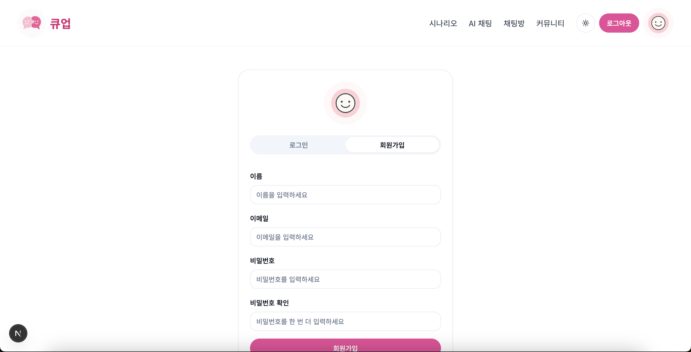
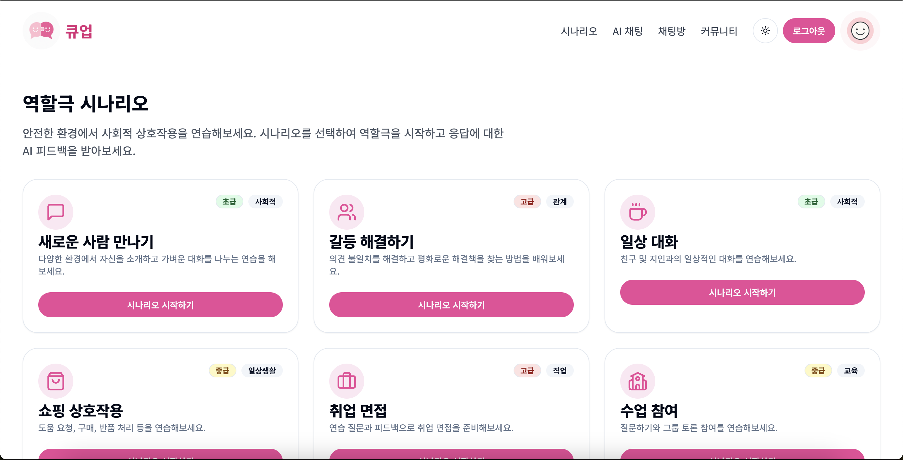
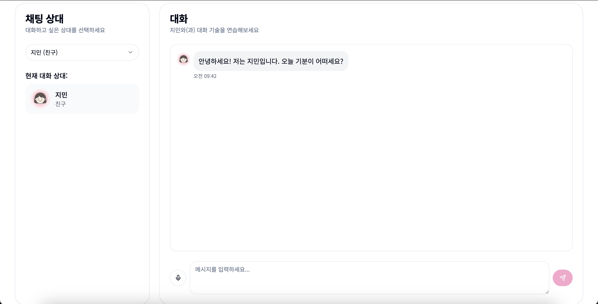
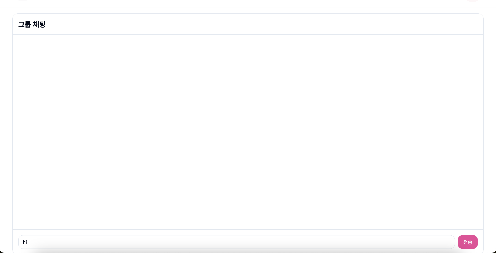

# 사회성 향상 웹 애플리케이션 (Autism Social Skills Web App)

## 목차
1. [프로젝트 구성 안내](#1-프로젝트-구성-안내)  
2. [프로젝트 사용법](#2-프로젝트-사용법)  
3. [프로젝트 기능 설명](#3-프로젝트-기능-설명)  
4. [프로그램 작성자](#5-프로그램-작성자)

---

## 1. 프로젝트 구성 안내

본 프로젝트는 자폐 스펙트럼을 가진 사용자들이 사회적 상호작용을 안전하고 편안하게 연습할 수 있도록 돕는 웹 기반 플랫폼입니다.  
세 가지 주요 기능군과 AI 피드백 시스템, 보상 메커니즘으로 구성되어 있습니다.

## 2. 프로젝트 사용법

이 웹 애플리케이션은 별도의 설치 없이 웹 브라우저에서 바로 이용할 수 있습니다.

### 접속 방법
- 정식 배포 링크:
- 모든 기능은 PC 및 모바일 환경 모두에서 접근 가능합니다.

### 사용 시 유의사항
- 일부 기능은 로그인 후 이용 가능합니다.  
- 채팅방 이용 시 닉네임 설정이 필요하며, 개인정보는 저장되지 않습니다.  
- AI 피드백 기능은 테스트 중이며, 계속해서 개선 중입니다.

## 3. 프로젝트 기능 설명

### 3.1 회원가입 및 로그인

- 사용자는 이름, 이메일, 비밀번호를 입력하여 계정을 생성할 수 있습니다.
- Firebase Authentication을 통해 안전하게 인증 관리가 이루어집니다.

---

### 3.2 역할극 시나리오

- 다양한 사회적 상황(예: 새로운 사람 만나기, 갈등 해결, 쇼핑, 면접 등)을 선택해 역할극 대화를 연습합니다.
- AI가 상황에 따라 응답하고 긍정적인 피드백을 제공합니다.

---

### 3.3 채팅 연습 기능

- 사용자는 친구, 부모, 선생님 등 가상의 대화 상대를 선택해 연습할 수 있습니다.
- 사용자의 입력에 따라 GPT 기반 응답이 출력되고, 피드백이 제공될 수 있도록 설계되었습니다.

---

### 3.4 커뮤니티 및 소셜 연결

- 다양한 주제별 그룹(예: 감정 인식, 직장 상호작용 등)에 참여해 사회성 기술을 함께 연습합니다.
- 자원봉사자 연결, 가상 이벤트, 그룹 채팅 기능 등이 포함되어 있습니다.

## 4. 프로그램 작성자

- 프로젝트명: 큐업(CUEUP)
- 작성자: 이시아, 김시현, 조수빈, 이하빈  
- 소속: 2025년도 세종대학교 인공지능융합대학 해커톤 프로젝트  
- 문의:
